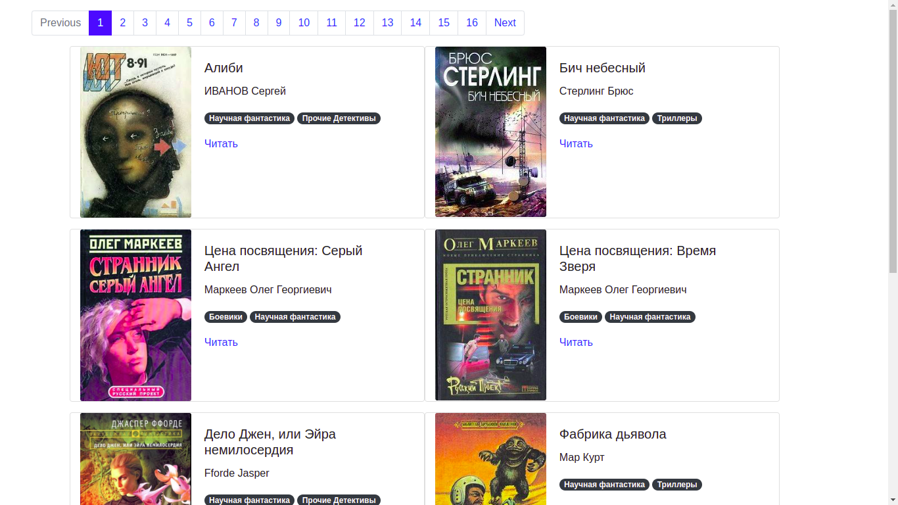

# Парсер книг с сайта tululu.org

## Запуск

- Скачайте код.
- Cоздайте файл `.env` в директории проекта, на основе файла `.env.example` командой 
(при необходимости скорректируйте значения переменных окружения):
```
cp .env.example .env
```
<details>
  <summary>Переменные окружения</summary>
  <pre>
    ROOT_PATH=downloads
    IMG_PATH=images
    BOOK_PATH=books
    SITE_URL_ROOT=https://tululu.org
    SITE_URI_TXT=txt.php
    DESCRIPTION_FILE=books.json
    CATEGORY_NAME=l55
    TIMEOUT=10
    RETRY_COUNT=5
    STATUS_FORCE_LIST=429,500,502,503,504
    ALLOWED_METHODS=HEAD,GET,OPTIONS
    AUTO_RELOAD=False
    PAGE_SIZE=10
    LIBRARY_PATH=pages
  </pre>
</details>

- Установите актуальную версию poetry в `UNIX`-подобных дистрибутивах с помощью команды:
```
curl -sSL https://raw.githubusercontent.com/python-poetry/poetry/master/get-poetry.py | python3 -
```
или в `Windows Powershell`:
```
(Invoke-WebRequest -Uri https://raw.githubusercontent.com/python-poetry/poetry/master/get-poetry.py -UseBasicParsing).Content | python -
```
- Добавьте к переменной окружения `$PATH` команду poetry:
```
source $HOME/.poetry/bin
```
- Установите виртуальное окружение в директории с проектом командой:
```
poetry config virtualenvs.in-project true
```
- Установите все зависимости (для установки без dev зависимостей можно добавить аргумент `--no-dev`):
```
poetry install
```
- Активируйте виртуальное окружение командой: 
```
source .venv/bin/activate
```
- Для запуска скрипта по списку идентификаторов вводим команду:
```
python3 tululu.py
```
- Есть возможность указать значения начального и конечного значения идентификатора книг через следующие опции:

- `-s` или `--start-id` c указанием начального значения идентификатора книги. По умолчанию значение равно 1.
- `-e` или `--end-id` c указанием конечного значения идентификатора книги. По умолчанию значение равно 10.
```
python3 tululu.py -s 50 -e 100
```
- Для запуска скрипта по конкретной категории вводим команду:
```
python3 tululu_category.py
```
- Есть возможность указать значения, используя следующие опции:

- `-s` или `--start-page` c указанием начального значения страницы категории книг. По умолчанию значение равно 1.
- `-e` или `--end-page` c указанием конечного значения страницы категории книг. По умолчанию значение равно 10.
- `-I` или `--skip-imgs` для пропуска скачивания соответствующего файла книги с указанием булева значения `true` или `false`. Также допустимы значения `0` или `1`. По умолчанию значение равно false. 
- `-T` или `--skip-txt` для пропуска скачивания соответствующего файла книги с указанием булева значения `true` или `false`. Также допустимы значения `0` или `1`. По умолчанию значение равно false.
- `-J` или `--json-path` с указанием пути для генерации `json` файла. По умолчанию значение указывает на текущую директорию. 
- `-D` или `--dest-folder` с указание пути, куда будет загружен весь контент, включая книги, обложки и `json` файл с описанием. По умолчанию значение берется из переменной окружения `ROOT_PATH`.
```
python3 tululu_category.py -s 1 -e 5 -I true -T false -J folder/some -D /home/user/books-test
```
- Для генерации `html` версии библиотеки вводим команду:
```
python3 render_website.py
```
В случае, если переменная окружения `AUTO_RELOAD=True` будет запущен веб-сервер для удобства локальной разработки с автоматической перезагрузкой в случае изменения шаблона `template.html`.
Также можно задать кол-во книг на странице при помощи переменной окружения `PAGE_SIZE`. По умолчанию, `PAGE_SIZE=10`.
При помощи переменной окружения `LIBRARY_PATH` задается местоположение, где будут находится сгенерированные html страницы. По умолчанию, `LIBRARY_PATH=pages`.

- С демо html версией библиотеки можно ознакомится [здесь]():  

- Для запуска линтеров используем команду:
```
flake8 . && mypy . && isort .
```


## Цели проекта
Код написан в образовательных целях на онлайн-курсе для веб-разработчиков [Devman](https://dvmn.org).
